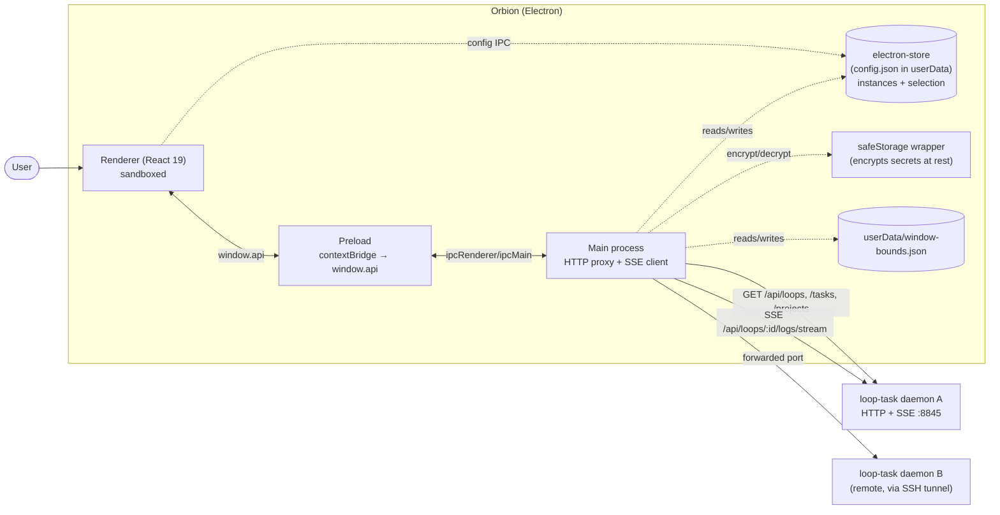
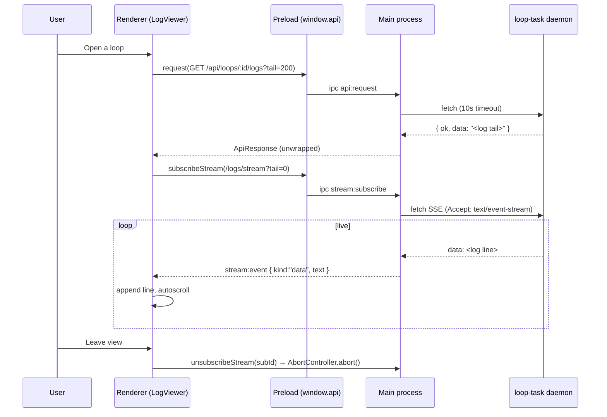

# Architecture — Orbion

## Architecture Overview

**Orbion** — the open-source control plane for Loop Engineering — is a
cross-platform **desktop application** (Electron) that acts
as a monitoring dashboard for one or more [loop-task](https://github.com/CKGrafico/loop-task)
daemons. Each daemon exposes an HTTP + SSE API; the app registers daemons by
their base URL and shows their loops, tasks, projects, and live logs from a
single window.

The architectural style is the **standard three-process Electron model** with a
strict security boundary:

- **Main process** — owns all network I/O (REST + SSE) and window/OS concerns.
- **Preload** — a thin, typed `contextBridge` that exposes a minimal, safe API
  surface to the renderer.
- **Renderer** — a sandboxed React 19 single-page UI with no direct Node or
  network access.

The renderer is deliberately isolated (`contextIsolation: true`,
`nodeIntegration: false`). All HTTP is proxied through the main process because
the loop-task daemon returns no CORS headers (renderer `fetch` would be blocked)
and because main-process fetch works identically for daemons on remote hosts.

The app is **read-only in v1** for direct loop editing: it observes loop-task state
and performs triage actions via the inbox (pause, resume, trigger, dismiss). Loop
creation is handled through the chat: when the agent (via MCP tools) proposes a
new loop, a proposal card appears in the chat stream for user approval. On
approval, the loop is created via `POST /api/loops`. If the command invokes an
agent runtime and no max-runs is set, the proposal includes a suggested cap.
Loop editing and deletion are not yet implemented.

## 1. Project Structure

```
orbion/
├── src/
│   ├── main/
│   │   ├── index.ts            # Electron main: window lifecycle, IPC handlers,
│   │   │                       #   HTTP proxy, SSE client, bounds persistence
│   │   ├── http-utils.ts       # Shared fetch + envelope unwrapping (fetchAndUnwrap)
│   │   ├── config-store.ts     # electron-store config + safeStorage wrapper
│   │   ├── credential-vault.ts # Dedicated safeStorage-encrypted credential records
│   │   ├── sibling-decline-store.ts # Persistent decline memory for sibling structural offers
│   │   ├── connection-supervisor.ts  # Periodic health probes + SSE reconnect
│   │   ├── reachability-tracker.ts   # Instance reachability as its own health layer (connected/reconnecting/unreachable)
│   │   ├── opencode-client.ts  # OpenCode server status + version checks
│   │   ├── agent-client.ts     # Agent streaming: OpenCode promptAsync + SSE events + interrupt
│   │   ├── platform-classifier.ts  # Git remote URL → platform classification
│   │   ├── transcript-store.ts # Per-session chat transcript file storage
│   │   ├── sse-parser.ts     # Spec-compliant SSE stream parser (eventsource-parser)
│   │   └── ssh-probe.ts        # SSH VM, Node 20+, loop-task, and daemon probing
│   ├── preload/
│   │   └── index.ts            # contextBridge → window.api (typed IPC surface)
│   ├── shared/
│   │   ├── ipc.ts              # IPC contract shared by main/preload/renderer
│   │   └── utils.ts            # Pure utilities: compareSemver, trimTrailingSlash
│   └── renderer/
│       ├── index.html          # Renderer HTML entry
│       └── src/
│           ├── main.tsx         # React root mount
│           ├── App.tsx          # Top-level layout, routing, polling, health
│           ├── api.ts           # REST + SSE client (real vs mock dispatch)
│           ├── mock.ts          # Fake data adapter for browser-only dev
│           ├── store.ts         # IPC-backed instance registry hook (fallback: localStorage in mock)
│           ├── types.ts         # Domain types mirrored from loop-task
│           ├── format.ts        # time/label/status formatting helpers
│           ├── theme.css        # Design tokens + all component styles
│           ├── bridge.d.ts      # Ambient window.api typing for the renderer
│           ├── features/
│           │   └── inbox/
│           │       └── InboxPanel.tsx  # Conversational inbox with fleet-scoped queries + inline actions
│           └── components/
│               ├── Sidebar.tsx           # Instance list + health dots
│               ├── FleetHealthFooter.tsx # Fleet health summary (instance count, failures, unreachable) in sidebar footer
│               ├── FleetActivityReadout.tsx # Agent-loop activity summary in sidebar footer
│               ├── SegmentedTabs.tsx     # Loops/Tasks/Projects pill switcher
│               ├── AddInstanceModal.tsx  # Register a new instance
│               ├── LoopsView.tsx         # Loop list for the selected instance
│               ├── LoopDetail.tsx        # Single-loop metadata + logs
│               ├── LoopCard.tsx          # Compact live card for one loop rendered in the chat stream (status dot, name, meta row, log tail, action buttons: pause/resume/stop/trigger with confirmation)
│               ├── LoopProposalCard.tsx  # Proposal card for chat-driven loop creation (command, interval, project, max-runs suggestion for agent commands, approve/reject)
│               ├── ChainEditProposalCard.tsx  # Proposal card for chat-driven chain edits (shared-task warning, fork decision, approve/reject)
│               ├── SiblingOfferCard.tsx  # Structural change offer card for sibling loops (per-instance approval, decline memory)
│               ├── LogViewer.tsx         # Tail + live SSE log follow
│               ├── TasksView.tsx         # Task definitions list
│               └── ProjectsView.tsx      # Projects list
├── electron.vite.config.ts     # electron-vite config (main/preload/renderer)
├── vite.web.config.ts          # Browser-only renderer dev server (mock mode)
├── tsconfig*.json              # Root + node (main/preload) + web (renderer) refs
├── package.json                # Scripts, deps (React 19, Electron 37)
├── out/                        # Build output (generated)
├── ARCHITECTURE.md / DESIGN.md / README.md
└── openspec/                   # Change-management workspace (agent workflow)
```

Two orthogonal build targets share `src/renderer`: the Electron renderer
(`electron.vite.config.ts`) and a plain-browser preview (`vite.web.config.ts`).

## 2. High-Level System Diagram



## 3. Core Components

### 3.1 Frontend / User Interface (Renderer)

- **Responsibility:** all presentation and interaction — instance selection,
  section switching, filtering, loop list/detail, and live log viewing.
- **Key files:** `App.tsx` (layout + orchestration), `components/*`, `theme.css`.
- **Technologies:** React 19 (function components + hooks), strict TypeScript,
  plain CSS with custom-property design tokens. No router, no state library.
- **State model:** local component state + a `useInstances` hook. "Routing" is a
  simple `view` discriminated union (`list` | `loop`) plus a `section` enum in
  `App.tsx` — there is no URL router. The chat transcript rows include a `loop-card`
  kind that renders a live `<LoopCard>` component bound to the polled loop data.
  LoopCard receives an optional `instance` prop (the full `Environment` object);
  when provided and the instance is reachable, the card fetches and displays a
  compact log tail (last 10 lines via `GET /api/loops/:id/logs?tail=10`) with
  error-line highlighting and a copy affordance. The card also renders contextual
  action buttons (Pause, Resume, Stop, Run Now) that call the daemon's mutation
  endpoints directly via `apiRequest`; destructive actions show an inline
  confirmation overlay before executing.
- The chat transcript rows include a `loop-proposal` kind that renders a
  `<LoopProposalCard>` component. When the agent (via MCP tools) proposes creating a
  loop, a proposal card appears in the stream showing command, interval, project,
  and options (run-immediately toggle, max-runs input). If the proposed command
  invokes an agent runtime (`opencode`, `claude-code`, `claude`, `codex`) and no
  max-runs is set, the card shows a suggested cap badge. On approval, Orbion calls
  `POST /api/loops` on the session's home instance and inserts a live `LoopCard`
  row. On rejection, nothing is created. Proposal state is persisted as special
  transcript messages (id starting with `loop-proposal-`) so it survives reloads.
- The chat transcript rows include a `chain-edit-proposal` kind that renders a
  `<ChainEditProposalCard>` component. When the agent proposes modifying a loop's
  task chain, a proposal card shows the proposed chain preview, operation summaries,
  and a shared-task warning if the edit affects a task used by other loops. On approval,
  the chain edit is applied via the MCP service.
- The chat transcript rows include a `sibling-offer` kind that renders a
  `<SiblingOfferCard>` component. After a structural chain edit is applied, Orbion
  identifies sibling loops on other reachable instances that share the same chain
  topology (same cached LoopShape) and offers the same structural change per sibling.
  Each offer requires its own explicit approval. Changes that only affect slot values
  (command text, command arguments, prompt wording) never trigger sibling offers.
  Declined offers are persisted in `sibling-decline-store.ts` (electron-store, 90-day
  retention) so the same structural offer is not shown again.
- **Inputs:** data from `api.ts`; persisted instances from `store.ts` via IPC.
- **Outputs:** IPC calls via `window.api`.

### 3.2 Backend / Server / API (Main process)

There is no separate server; the **Electron main process is the backend**
(`src/main/index.ts`). Responsibilities:

- **`handleApiRequest`** — proxies REST calls to a daemon with a 10s timeout
  (`AbortController`), then unwraps the loop-task `{ ok, data }` /
  `{ ok, error: { message } }` envelope into the app's `ApiResponse` shape.
  Validates that the base URL is `http:`/`https:` before fetching.
- **`handleStreamSubscribe`** — an SSE client powered by `sse-parser.ts`: streams the
  response body through a spec-compliant `eventsource-parser`, correctly concatenating
  multi-line `data:` fields and handling chunk-boundary splits, and forwards parsed
  `data:` / `event:` events to the renderer as `stream:event` messages. Subscriptions
  are tracked in a `Map<subId, AbortController>` for clean teardown.
- **Tunnel auto-reconnect** (`tunnel-registry.ts` + `ssh-tunnel.ts`) — when
  an SSH tunnel process exits unexpectedly (network blip, keepalive timeout),
  the registry automatically retries reopening it with exponential backoff
  (1 s → 16 s cap, indefinite retry). `ssh-tunnel.ts` fires an `onTunnelExit`
  callback for unexpected exits (distinguishing them from intentional closes
  via `closeTunnel()`). On successful reconnect, `tunnel-registry.ts` invokes
  the registered `onTunnelReconnect` callback, which `index.ts` uses to wake
  up the connection supervisor so it probes immediately.
- **Config store** (`config-store.ts`) — manages instance and selection state
  via `electron-store` (typed JSON in `userData`). Exposes CRUD operations
  (`getInstances`, `addInstance`, `removeInstance`, `getSelectedInstanceId`,
  `setSelectedInstanceId`) and a one-time `migrateFromLocalStorage` function.
  Each environment records its default agent runtime (`opencode` or `claude`)
  and opaque references to any wizard-owned credentials. The dedicated
  `credential-vault.ts` store holds only `safeStorage`-encrypted credential
  payloads. Removing an environment removes every credential it references.
  Every mutating write bumps a **version stamp** (`configStamp`:
  `{ timestamp, revision }`), enabling stale-overwrite detection: before
  writing, callers compare their last-known stamp against the file's current
  stamp; if stale (config changed on another machine), a warning dialog
  offers pull-remote or overwrite-anyway. Last-write-wins remains the model;
  this is a guardrail, not a merge system.
- **SSH onboarding** (`vm-wizard.ts`, `ssh-probe.ts`, `ssh-launch.ts`, `runtime-adapter.ts`) — after
  SSH authentication, probes Node.js, the `loop-task` command, and daemon state.
  Node.js 20 or newer is required. A missing loop-task command produces an
  explicit install-and-start checkpoint. After service selection, the wizard
  checks the chosen agent runtime's availability via `runtime-adapter.ts`, which
  isolates OpenCode and Claude Code detection/install logic behind a small
  adapter interface. If the runtime is missing, a consent step offers to install
  it. The result (available/unavailable/unknown) is stored as `runtimeState` on
  the `Environment`. The pinned global npm install and
  daemon launch run over SSH, bind the daemon to `127.0.0.1`, and use a bounded
  readiness check before the environment is saved. Local/direct instances are
  validated only through their supplied API URL and remain user-managed.
- **Window management** — single-instance lock, custom hidden titlebar with a
  Windows overlay, `ready-to-show` gating, and external links routed to the
  system browser via `setWindowOpenHandler`.
- **Window-bounds persistence** — debounced save of size/position/maximized
  state to `window-bounds.json` in the Electron `userData` dir.

IPC handlers registered on `app.whenReady`: `api:request`, `stream:subscribe`,
`stream:unsubscribe`, `config:getInstances`, `config:addInstance`,
`config:removeInstance`, `config:getSelectedInstanceId`,
`config:setSelectedInstanceId`, `config:migrateFromLocalStorage`,
`infra:executeAction`, `infra:getStatus`, `infra:getPlatform`,
`budget:getWatches`, `budget:addWatch`, `budget:removeWatch`,
`budget:updateWatch`, `budget:getBreaches`, `budget:addBreach`,
`budget:dismissBreach`, `inbox:getItems`, `inbox:dismissItem`,
`inbox:queryFleet`, `inbox:resolveItem`, `inbox:getResolvedItems`,
`inbox:pruneResolvedItems`, `reachability:getStatus`, `reachability:getAll`, `transcript:getMessages`, `transcript:appendMessage`, `transcript:appendMessages`, `transcript:updateMessage`, `transcript:deleteSession`, `agent:sendPrompt`, `agent:interrupt`, `config:getConfigStamp`, `config:stampCheckedSetMainVm`, `config:forceSetMainVm`, `siblingDecline:isDeclined`, `siblingDecline:recordDecline`. The `agent:sendPrompt` handler initiates a streaming agent response via the OpenCode runtime (promptAsync + SSE events), while `agent:streamEvent` is a push channel that forwards streaming events (text-delta, tool-call-start, tool-call-output, turn-finished, turn-error, turn-interrupted) to the renderer. The `agent:interrupt` handler aborts an in-flight generation, preserving partial output. The `config:getConfigStamp`, `config:stampCheckedSetMainVm`, and `config:forceSetMainVm` handlers implement versioned config writes with stale-overwrite detection: the stamp-checked variant compares the caller's last-known stamp against the on-disk stamp and returns a conflict result on mismatch, while the force variant writes regardless of staleness (last-write-wins with explicit consent). The inbox service also performs inline
actions (`run-now`, `pause`, `resume`, `restart`, `dismiss`, `open-in-chat`)
via its `executeInboxAction` method, which calls the same loop-task API
endpoints as the loop card (`POST /api/loops/:id/trigger`,
`POST /api/loops/:id/pause`, `POST /api/loops/:id/resume`, `POST /api/loops/:id/stop`). The `infra:executeAction` handler supports
actions: `machine-status`, `clone-repo`, `create-issue`,
`detect-platform`, `list-issues`, `add-label`, `edit-issue`.

### 3.3 Shared Libraries / Common Code

- **`src/shared/ipc.ts`** — the single source of truth for the IPC contract:
  `ApiRequestArgs`, `ApiResponse<T>`, `StreamSubscribeArgs`,
  `StreamEventPayload`, `Instance`, `ConfigBridge`, `LoopTaskBridge`
  (the shape of `window.api`, including the `config` sub-bridge),
  `PlatformType`, `PlatformDetectionResult`, `DetectPlatformParams`,
  the `InfraBridge` (including `getPlatform`), `ListIssuesParams`,
  `IssueCard`, `ListIssuesResult`, `CreateIssueParams`, `CreateIssueResult`,
  `AddLabelParams`, `AddLabelResult`, `EditIssueParams`, `EditIssueResult`,
  `InboxItemKind` (including `failed-loop`, `finished-loop`, `breach`,
  `instance-offline`, `prolonged-offline`), `InboxAction` (inline triage
  verbs: `run-now`, `pause`, `resume`, `restart`, `dismiss`, `open-in-chat`),
  `InboxItem` (with `availableActions` and `projectId` fields),
  `ResolvedInboxItem`, `InboxItemResolutionReason`, `InboxQueryResult`,
  `BudgetWatch`, `BudgetBreach`, `ConditionWatch`, `WatchCondition`,
  `WatchTarget`, `WatchConditionKind`, `OutageEscalation`,
  `AgentSendPromptArgs`, `AgentSendPromptResult`, `AgentStreamEvent`,
  `AgentBridge`.
   Imported by all three layers so the boundary stays type-safe.
- **`src/renderer/src/types.ts`** — domain types (`LoopMeta`, `RunRecord`,
  `Project`, `TaskDefinition`, `Instance`, `LoopStatus`, `InstanceHealth`)
  mirrored from the loop-task daemon.
- **`src/renderer/src/format.ts`** — pure helpers: `timeAgo`, `timeUntil`,
  `commandLine`, `hostLabel`, and the `STATUS_COLORS` palette.
- **`src/main/platform-classifier.ts`** — pure classifiers: `classifyPlatform`
  and `parseGitRemoteOutput`. Matches git remote URLs against GitHub and
  Azure DevOps patterns, returning `PlatformType`. No Electron dependencies.

### 3.4 Preload

- **`src/preload/index.ts`** — builds a `LoopTaskBridge` and exposes it as
  `window.api` via `contextBridge.exposeInMainWorld`. Wraps `ipcRenderer.invoke`
  for request/subscribe/unsubscribe and `ipcRenderer.on("stream:event", …)` for
  push events, returning an unsubscribe cleanup for the listener. The `config`
  sub-bridge wraps the config-store IPC channels for instance CRUD and
  localStorage migration.

### 3.5 CLI / Scripts / Automation

No application CLI. Automation is limited to `package.json` npm scripts
(`dev`, `dev:web`, `build`, `start`, `typecheck`).

## 4. Data Flow

**Loop list (polled):** on instance select, `App.tsx` calls `fetchLoops` every
5s. Success updates the loop list and marks the instance `ok`; failure marks it
`offline`. Non-selected instances are health-checked every 20s in the
background.

**SSH machine onboarding:** after SSH reachability succeeds, the main process
checks Node.js 20+, detects the `loop-task` command, and inspects daemon state.
If loop-task is missing, the renderer presents one install-and-start action.
The main process installs the pinned package, starts the daemon on loopback, and
waits for API or listening-port readiness. On failure, bounded stdout, stderr,
and remote install/daemon logs are returned to the wizard for retry or cancel.

**Log follow (pushed):** `LogViewer` first fetches an initial tail
(`GET /api/loops/:id/logs?tail=200`), then opens an SSE subscription. `api.ts`
keeps one global `stream:event` listener that dispatches to per-subscription
callbacks keyed by `subId`; lines are appended (capped at 2000) with autoscroll
while "following".

**Agent streaming (pushed):** When the user sends a prompt in a chat session,
the renderer calls `agent:sendPrompt` which proxies to the OpenCode runtime's
`session/prompt` endpoint in the main process. The main process then subscribes
to the agent's SSE event stream (`v2/session/events`) and forwards parsed events
to the renderer as `agent:streamEvent` messages. The `SessionChatView` component
renders text deltas incrementally and shows a Stop button during streaming.
Pressing Stop triggers `agent:interrupt`, which aborts the SSE stream locally
and sends an interrupt signal to the OpenCode runtime; partial output is kept
in the transcript.



## 5. Data Stores

The app has **no formal database**; all authoritative domain data lives in the
loop-task daemons. Local persistence uses these mechanisms:

- **electron-store** (main process, `config-store.ts`): a typed JSON store in
  Electron's `userData` directory holding registered environments
  (`Environment[]`), opaque credential references, the selected environment id,
  and related state. Accessed by the renderer only through typed IPC channels. This
  eliminates the renderer-side `localStorage` XSS surface from previous
  versions.
  All mutating operations are serialized through a `serialize()` wrapper that
  chains writes via a single Promise queue (`writeChain`), preventing
  read-modify-write race conditions when concurrent IPC handlers overlap.
  Internal (private) `_impl` functions bypass the queue; only the public
  exported wrappers enter it — so cross-calls within a mutation (e.g.
  `storeSessionToken` → `setEnvironmentAuthState`) cannot deadlock.
- **credentials electron-store** (main process, `credential-vault.ts`): a
  separate local vault containing encrypted credential payloads keyed by opaque
  random references. Wizard-generated daemon session tokens and optional SSH
  key passphrases are encrypted with Electron `safeStorage` before write and
  decrypted only for main-process consumers. Environment config never contains
  these values or their ciphertext.
- **window-bounds.json** (main, in Electron `userData`): window
  size/position/maximized state.
- **Transcript store** (main process, `transcript-store.ts`): per-session chat
  transcript files stored as individual JSON arrays under
  `userData/transcripts/<sessionId>.json`. Each file holds an array of
  `TranscriptMessage` objects (user messages, assistant messages, tool calls).
  Messages carry an optional `environmentId` field indicating which instance
  produced them; legacy messages without this field are attributed implicitly
  from the session. Transcripts are instance-independent: they are keyed by
  `ChatSession.id`, not by any `environmentId`, so they survive instance removal
  or unreachability. When the user switches the instance selector mid-session,
  an interrupt is sent to the old instance's agent, a handoff divider row is
  persisted (with `instance-switch-*` message IDs), and the MCP connection is
  refreshed on the new instance. The handoff divider appears as a distinct
  visual row (not a chat bubble) between messages from different instances.
  Writes are serialized per-session through a `serializeSession()` queue to
  prevent read-modify-write races. A debounce timer (200ms) batches rapid
  streaming content updates to reduce disk I/O. When a `ChatSession` is removed,
  the corresponding transcript file is also deleted.

A **safeStorage wrapper** (`config-store.ts`: `encryptValue`/`decryptValue`) and
the dedicated credential vault use OS-native encryption (DPAPI on Windows,
Keychain on macOS, libsecret on Linux). Wizard session tokens and SSH key
passphrases are stored in the vault; existing OpenCode endpoint passwords remain
encrypted by the config store. If `safeStorage.isEncryptionAvailable()` returns
`false`, credential storage is rejected. The `setOpenCodeEndpoint` IPC returns
`{ ok: false, reason: "encryption-unavailable" }` and a dialog is shown to the
user. The `wasEncrypted` flag on the internal `InternalOpenCodeEndpoint`
type (main-process only, never exposed to renderer via IPC) tracks whether
a password was encrypted, enabling correct decryption behavior and backward
compatibility with legacy unencrypted entries.

**Migration:** on first launch after upgrade, `config:migrateFromLocalStorage`
reads the old `lta.instances.v1` and `lta.selectedInstance.v1` localStorage
keys, writes them into electron-store, and clears the keys. The renderer's
`store.ts` handles this automatically.

## 6. External Integrations / APIs

**loop-task daemon HTTP + SSE API** is the only external integration.

- **Method:** `fetch` from the main process. Base URL is user-provided per
  instance (e.g. `http://127.0.0.1:8845`).
- **Endpoints consumed:** `GET /api/loops`, `POST /api/loops`, `GET /api/loops/:id`,
  `GET /api/projects`, `GET /api/tasks`, `GET /api/loops/:id/logs?tail=N`,
  `GET /api/loops/:id/logs/stream` (SSE).
- **Issues integration:** the `list-issues` and `edit-issue` infra actions
  query and mutate the platform CLI (gh / az) for filtered issue lists and
  issue edits, rendered as compact card stacks and confirmation prompts in
  the InfraChatPanel. No persistent backlog surface is introduced; issues
  appear only through the conversational chat.
- **Envelope:** responses are unwrapped from loop-task's
  `{ ok, data }` / `{ ok, error: { message } }` shape.
- **Auth:** none (the daemon is a local/trusted service).
- **Failure behavior:** 10s request timeout → structured error; failed polls
  flip the instance health dot to `offline`; SSE `error`/`end` closes the
  subscription. Errors are surfaced in the UI rather than thrown.
  SSH tunnel processes that exit unexpectedly are automatically reconnected
  with exponential backoff (1 s → 2 s → 4 s → 8 s → 16 s cap, indefinite
  retry). On successful tunnel reconnect, the connection supervisor is
  woken up immediately so it probes and transitions to `connected` without
  waiting for its own backoff timer. No error dialog is shown; the only
  visual signal is the health dot transitioning through connecting/backoff
  phases (orange) back to connected (green).
- **Config location:** instance URLs are stored in `electron-store` (main process),
  entered via `AddInstanceModal`, and accessed through the typed IPC contract.

## 7. Key Technologies

| Technology | Role | Architectural relevance |
|---|---|---|
| Electron 37 | Desktop shell | Provides the main/preload/renderer split and OS integration |
| electron-vite 4 | Build tool | Bundles the three processes; HMR in dev |
| electron-store 11 | Config persistence | Typed JSON store in userData; replaces renderer localStorage |
| Vite 7 | Bundler/dev server | Renderer builds + browser-only preview |
| React 19 | UI framework | Component-based renderer |
| TypeScript 5.8 (strict) | Language | Type-safe IPC contract across process boundaries |
| Plain CSS + custom properties | Styling | Design tokens in `theme.css`; no CSS framework |
| Server-Sent Events (SSE) | Log streaming | Push-based live log following |
| rehype-sanitize 6 | HTML sanitization | Strips dangerous HTML (script, iframe, event handlers) from all markdown rendered via react-markdown; defense-in-depth against XSS in the Electron renderer |
| react-markdown 10 | Chat markdown rendering | Renders assistant messages with code highlighting + HTML sanitization |
| highlight.js 11 | Code syntax highlighting | Used via rehype-highlight in MarkdownContent |
| Electron safeStorage | Encryption-at-rest | OS-native encryption wrapper; encrypts session tokens and OpenCode passwords; rejects storage when unavailable |
| pnpm | Package manager | Dependency management (Node >= 20) |

## 8. Deployment & Infrastructure

- **Build:** `pnpm build` (`electron-vite build`) emits `out/main`,
  `out/preload`, `out/renderer`. `main` in `package.json` points at
  `./out/main/index.js`.
- **Run:** `pnpm dev` (full Electron with HMR); `pnpm start`
  (`electron-vite preview`) previews a production build; `pnpm dev:web`
  serves the renderer in a browser on port 5183 with mocked data.
- **Packaging/installers:** Not evident from the repository (no
  electron-builder/forge config present).
- **Containerization / CI/CD / hosting:** Not evident from the repository — this
  is a locally-run desktop app.
- **Env config:** `ELECTRON_RENDERER_URL` (set by electron-vite in dev) selects
  loading the dev server vs the built `index.html`.

## 9. Security Architecture

- **Renderer sandboxing:** `contextIsolation: true`, `nodeIntegration: false`.
  The renderer has no Node/network access and reaches the outside world only
  through the narrow `window.api` bridge.
- **No localStorage for config:** instance data is stored in the main process
  via `electron-store`, eliminating the renderer-side XSS surface that
  `localStorage` exposed. The renderer accesses config only through the typed
  IPC contract.
- **Encryption-at-rest readiness:** a `safeStorage` wrapper is available in
  `config-store.ts` for encrypting legacy secrets, and `credential-vault.ts`
  stores wizard credentials separately from environment config. Session tokens
  and SSH key passphrases use opaque environment references; OpenCode endpoint
  passwords remain encrypted through the config-store wrapper. If
  `safeStorage.isEncryptionAvailable()` returns `false` (e.g. Linux without
  libsecret), credential storage is **rejected** with a user-facing error.
  Credentials are never stored in plaintext. The `wasEncrypted` flag is kept on
  an internal-only `InternalOpenCodeEndpoint` type and is stripped before
  environments are sent to the renderer via IPC.
- **URL validation:** the main process rejects any base URL that is not
  `http:`/`https:` before making a request.
- **Markdown sanitization:** all markdown rendered via `MarkdownContent.tsx`
  passes through `rehype-sanitize`, which strips `<script>`, `<iframe>`,
  event handlers (`onerror`, `onclick`, etc.), and `javascript:` URLs.
  Untrusted strings interpolated into markdown (machine names, URLs,
  issue titles, labels from daemon/API responses) are escaped via
  `escapeMd()` before interpolation, preventing injection of markdown
  formatting or HTML tags.
- **External links:** `setWindowOpenHandler` denies in-app navigation and opens
  links in the system browser.
- **CLI argument sanitization:** all user-controlled strings passed to `execFile("gh", ...)` and
  `execFile("az", ...)` are validated before execution:
  - Labels are validated against `^[a-zA-Z0-9_.:/-]+$` and rejected if they start with `--`.
  - Repo strings must match the `owner/repo` format (`^[a-zA-Z0-9_.-]+/[a-zA-Z0-9_.-]+$`).
  - Title and body fields have control characters (newlines, null bytes, tabs) stripped
    via `sanitizeText()` before being passed as CLI arguments.
  - This prevents argument injection, flag injection, and newline-based output confusion
    at all `gh`/`az` invocation sites.
- **Trust boundary:** renderer ⇄ preload ⇄ main. Only the main process performs
  network and filesystem I/O.
- **Auth/secrets:** OpenCode endpoint passwords are encrypted at rest via
  `safeStorage`. Session tokens are similarly encrypted. Both `setOpenCodeEndpoint`
  and `setInfraOpenCodeEndpoint` reject plaintext storage when the OS keychain
  is unavailable. The `wasEncrypted` metadata is internal-only and never crosses
  the IPC boundary.

## 10. Monitoring & Observability

- **Health:** per-instance connectivity dots (`ok` / `offline` / `unknown` / `connecting` / `backoff` / `blocked`)
  driven by poll/health-check results.
- **Reachability:** a first-class health layer, distinct from loop data. Each instance
  carries reachability `connected` / `reconnecting` / `unreachable`, derived from tunnel
  + API health (ConnectionPhase), **never** from loop exit codes. Loops on an
  unreachable instance render as "unknown" (greyed) and are excluded from failure
  tallies. This ensures a dropped tunnel never reads as "loop failed." The state is
  exposed to the renderer as a first-class field via the `reachability` IPC bridge.
- **Logs:** the app *views* daemon logs; it does not emit structured telemetry
  of its own.
- **Metrics / tracing / error reporting:** Not evident from the repository.
  Non-fatal errors are swallowed (e.g. bounds save, clipboard).

## 11. Performance & Scalability

- **Polling cadence:** selected instance loops every 5s; background health every
  20s.
- **Log buffering:** the viewer caps in-memory lines at 2000 (`MAX_LINES`) and
  starts from a 200-line tail.
- **SSE efficiency:** a single global `stream:event` listener fans out to
  per-subscription callbacks; subscriptions are aborted on teardown.
- **Debounced persistence:** window bounds save is debounced (500ms).
- **Known limitation:** polling (not events) for the loop list is a stopgap
  until the daemon feeds `/api/events` server-side.

## 12. Development Workflow

```bash
pnpm install     # install dependencies (Node >= 20)
pnpm dev         # Electron app (main + preload + renderer, hot reload)
pnpm dev:web     # renderer-only in a browser, mocked data (port 5183)
pnpm typecheck   # tsc --noEmit for node + web project references
pnpm build       # production build into out/
pnpm start       # preview a production build
```

There is no lint script configured in `package.json`.

## 13. Testing Strategy

**No test suite exists** in the repository — no test framework, test files, or
coverage gates. Type checking (`pnpm typecheck`) is the only automated
correctness gate. The mock adapter (`mock.ts`) enables manual UI verification
and screenshots without a daemon. This is a notable gap (see §15).

## 14. Architectural Decisions & Rationale

- **HTTP in the main process, not the renderer.** The loop-task daemon sends no
  CORS headers, so renderer `fetch` would be blocked; main-process fetch also
  transparently supports remote daemons. Evidence: comments in `ipc.ts` and the
  proxy in `main/index.ts`.
- **Minimal, typed IPC surface.** Exactly three invoke channels + one event
  channel, all typed via `shared/ipc.ts`, keeping the trust boundary small.
- **Poll loops, push logs.** Reflects current daemon capabilities: loop status
  has no server-fed event stream yet, but logs do.
- **Mock-adapter fallback.** `isMock = !window.api` lets the same renderer run in
  a plain browser for fast UI iteration and screenshots.
- **No router / no state library.** The UI is small enough that a `view` union +
  local state is simpler than adding dependencies.
- **Local-only persistence.** Instances in `electron-store` (main process), bounds
  in a JSON file; the app intentionally owns no durable domain data. localStorage
  is used only as a fallback in mock mode (browser-only dev with no Electron).

## 15. Constraints, Risks, and Technical Debt

- **Remote daemons require SSH port forwarding** — loop-task binds its API to
  `127.0.0.1` only. A configurable bind address upstream would remove this.
- **Hand-maintained type mirror** — `types.ts` can drift from the daemon's real
  API; there is no codegen from `openapi.json`.
- **No automated tests** and **no CI**.
- **No lint tooling** configured.
- **Silent error handling** in a few spots (bounds save, clipboard, JSON parse)
  trades observability for resilience.
- **Read-only except loop creation** — mutation actions beyond proposal-driven creation are not yet implemented.
- **No packaging config** — there is no shippable installer setup yet.

## 16. Future Considerations

- **Documented (README):** configurable daemon bind address to drop the SSH
  tunnel step; feeding `/api/events` server-side to replace polling; adding
  additional mutation actions (edit, delete loops via proposal flow).
- **Recommended (not yet planned):** generate `types.ts` from the daemon's
  `openapi.json`; add a test suite + CI; add lint config; add electron-builder
  packaging for distributable installers.

## 17. Project Identification

- **Name:** orbion (Orbion)
- **Version:** 0.1.0
- **Language:** TypeScript (strict)
- **Type:** Electron desktop application (React renderer)
- **Runtime:** Electron 37 / Node >= 20
- **Package manager:** pnpm
- **License:** MIT
- **Maintainer:** Quique Fdez Guerra
- **Date of review:** 2026-07-04

## 18. Glossary / Acronyms

- **loop-task** — the upstream daemon this app monitors; runs commands on a
  schedule ("loops"), organized by projects and reusable task definitions.
- **Instance** — a registered loop-task daemon, identified by name + base URL.
- **Loop** — a scheduled, repeating command execution with run history.
- **Task (definition)** — a reusable command template with success/failure
  chaining (`onSuccessTaskId` / `onFailureTaskId`).
- **Project** — a named/colored grouping of loops on a daemon.
- **Run / RunRecord** — a single execution of a loop, with exit code, duration,
  and log offset.
- **SSE** — Server-Sent Events; the push transport for live logs.
- **IPC** — Inter-Process Communication between Electron main and renderer.
- **contextBridge** — Electron API that safely exposes `window.api` to the
  sandboxed renderer.
- **Envelope** — the loop-task response wrapper `{ ok, data | error }`.
- **Mock mode** — renderer running without `window.api` (plain browser), backed
  by `mock.ts`.

<!-- Last updated: 2026-07-19T20:00:00Z -->
